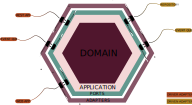

# Inoversity Library Web Api


Inoversity Library **Web Api** built in C# using the
`Ports & Adapters` architecture, aka `Clean Architecture`.



## Developer Setup Guide

> **_INFO:_** The project requires .NET 7. To install dotnet, head
> over to [microsoft](https://dotnet.microsoft.com/en-us/download) for installation details.

This section outlines the development setup of the `Inoversity Library Web Api`. If you're not
a shell fan, you can accomplish the same outcome (getting to build the project) using your preferred IDE.

1. Clone the repository to your development environment.
    ```
    git clone <repository_url>
    ```
2. Set working directory.
    ```
    cd ./Inoversity.Library.WebApi/InoversityLibrary/
    ```
3. Restore dependencies.
    ```
    dotnet restore .
    ```
4. Build up the project solution.
    ```
    dotnet build .
    ```

That will be all. Code ahead.

## Docker Setup Guide

This section outlines the setup for a docker container.

## Stack Overview

### Overall
| Library | Description | External Content |
|---------|-------------|------------------|

### API Server
| Library                                 | Description            | External Content                                                                                     |
|-----------------------------------------|------------------------|------------------------------------------------------------------------------------------------------|

### Testing
| Library                                                              | Description                 | External Content                                                                                                                                     |
|----------------------------------------------------------------------|-----------------------------|------------------------------------------------------------------------------------------------------------------------------------------------------|

### Database Migrations
| Library     | Description         | External Content                 |
|-------------|---------------------|----------------------------------|

## Features
### Included
- [X] Conventional commits
- [X] Github actions [Continuous Integration](https://www.atlassian.com/continuous-delivery/continuous-integration)
- [X] Automatic semantic versioning
- [X] Standard branch name format

### Feature Backlog
- [ ] UnitTesting
- [ ] Git tagging
- [ ] Authentication
- [ ] Documentation
- [ ] Authorisation
- [ ] Database migrations
- [ ] Kubernetes cluster integration [Continuous Deployment](https://www.atlassian.com/continuous-delivery/principles/continuous-integration-vs-delivery-vs-deployment)
- [ ] Event messaging integration
- [ ] Api Stress Testing
