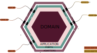

# zoRn Event Marketplace

Inoversity Library **Web Api** built in C# using the
`Ports & Adapters` architecture, aka `Clean Architecture`.

## Developer Setup Guide

This section outlines the development setup of the `Inoversity Library Web Api`.
> **_NOTE:_** These steps will apply when the project's directory has been set as
> the working directory. Adjust accordingly if the working directory is different
> from project directory.

## Docker Setup Guide

This section outlines the setup for a docker container.

## Stack Overview

### Overall
| Library        | Description               | External Content                 |
|----------------|---------------------------|----------------------------------|

### API Server
| Library                                 | Description            | External Content                                                                                     |
|-----------------------------------------|------------------------|------------------------------------------------------------------------------------------------------|
                                                                   |

### Testing
| Library                                                              | Description                 | External Content                                                                                                                                     |
|----------------------------------------------------------------------|-----------------------------|------------------------------------------------------------------------------------------------------------------------------------------------------|

### Database Migrations
| Library     | Description         | External Content                 |
|-------------|---------------------|----------------------------------|

## Features

### Included

### Feature Backlog
- [ ] Kubernetes cluster integration
- [ ] Event messaging integration
- [ ] API Stress Testing
